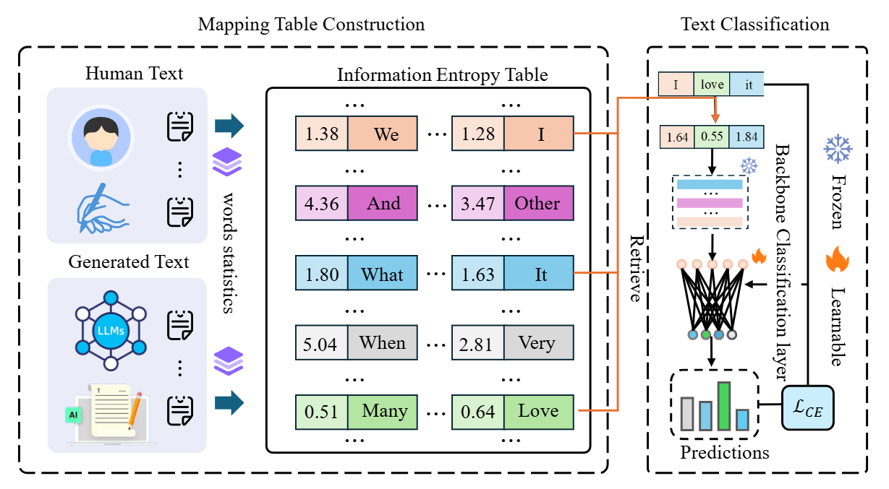

# Information Entropy for LLM-generated Text Detection

This project provides a Python implementation for text featurization using **Information Entropy (IED)** and **Information Entropy Gain (IEGD)**, coupled with a simple classifier for tasks like distinguishing between human-generated and LLM-generated text. The methods are inspired by information-theoretic approaches to quantify word importance and text characteristics.



---

## 📜 Overview

The core idea is to represent text documents as sequences of numerical values derived from information theory. These feature vectors can then be fed into a neural network (an LSTM in this case) for classification. The project implements:

1.  **Information Entropy based Detection (IED)**: Calculates the information entropy of each word based on its global frequency in a dataset.
2.  **Information Entropy Gain based Detection (IEGD)**: Calculates the information gain provided by each word for the entire dataset.
3.  A PyTorch-based **LSTM classifier** to learn from these entropy-based feature sequences.
4.  Helper utilities for text tokenization, dataset creation, and batch collation.

This implementation is based on concepts where word probabilities and their contributions to dataset entropy are used to create discriminative features.

---

## ✨ Features

* **Simple Tokenizer**: Basic text preprocessing (lowercase, alphanumeric words).
* **IED Featurization**:
    * `calculate_word_probabilities()`: Computes $q(g_i, D)$, the global probability of word $g_i$ in dataset $D$.
    * `build_ied_mapping_table()`: Creates a lookup table for word information entropy $H(g_i, D) = -q(g_i, D) \log_2 q(g_i, D)$.
    * `transform_text_to_ie_vector()`: Converts tokenized text into a sequence of IED values.
* **IEGD Featurization**:
    * `calculate_dataset_entropy_H_D()`: Computes the total entropy of the dataset $H(D) = \sum_{g_i \in G} H(g_i, D)$.
    * `calculate_entropy_of_word_dist()`: Calculates entropy for subsets of documents (e.g., $H(D_{g_i})$).
    * `build_iegd_mapping_table()`: Creates a lookup table for word information entropy gain $IEG(D, g_i) = H(D) - H(D|g_i)$, where $H(D|g_i) = \frac{|D_{g_i}|}{|D|}H(D_{g_i}) + \frac{|D_{\neg g_i}|}{|D|}H(D_{\neg g_i})$.
    * `transform_text_to_ieg_vector()`: Converts tokenized text into a sequence of IEGD values.
* **PyTorch Integration**:
    * `TextDataset`: Custom `Dataset` class.
    * `collate_fn`: Pads sequences for batching.
    * `SimpleLSTMClassifier`: An LSTM model for sequence classification.
* **Example Usage**: Demonstrates the workflow from raw text to training and basic evaluation.

---

## ⚙️ How It Works

The general workflow is as follows:

1.  **Preprocessing**:
    * Input texts are tokenized using `tokenize_text()`.
2.  **Feature Engineering (Choose IED or IEGD)**:
    * **For IED**:
        1.  `build_ied_mapping_table()` is called with all tokenized documents to compute the IED value for each unique word in the corpus.
        2.  Each document is then transformed into a vector of IED values using `transform_text_to_ie_vector()`.
    * **For IEGD**:
        1.  `build_iegd_mapping_table()` is called with all tokenized documents to compute the IEGD value for each unique word.
        2.  Each document is transformed into a vector of IEGD values using `transform_text_to_ieg_vector()`.
3.  **Data Preparation for PyTorch**:
    * The generated feature vectors (sequences of IED/IEGD values) and corresponding labels are encapsulated in a `TextDataset`.
    * A `DataLoader` is used to create batches, with `collate_fn` handling the padding of sequences to ensure uniform length within each batch.
4.  **Model Training**:
    * The `SimpleLSTMClassifier` takes the padded sequences of entropy values as input.
    * The LSTM processes these sequences, and its final hidden state is passed through a fully connected layer with a sigmoid activation for binary classification.
    * The model is trained using standard PyTorch training loops with Binary Cross Entropy Loss (`BCELoss`) and an optimizer like Adam.
5.  **Evaluation**:
    * The trained model can then be used to predict labels for new, unseen text data (after undergoing the same preprocessing and feature transformation steps).

---

## 🛠️ Code Structure

### Helper Functions & Data Handling

* `tokenize_text(text: str) -> List[str]`:
    * Converts text to lowercase and extracts alphanumeric words.
* `TextDataset(Dataset)`:
    * Standard PyTorch `Dataset` to hold feature vectors and labels.
* `collate_fn(batch)`:
    * Pads sequences of feature vectors in a batch to the maximum sequence length in that batch. Essential for RNNs.

### IED: Information Entropy based Detection

* `calculate_word_probabilities(all_docs_tokenized: List[List[str]]) -> Dict[str, float]`:
    * Calculates $q(g_i, D)$, the global probability (frequency) of each word $g_i$ across the entire dataset $D$. (Refers to equation (2) in the cited paper).
* `build_ied_mapping_table(all_docs_tokenized: List[List[str]]) -> Dict[str, float]`:
    * Constructs a mapping where each word $g_i$ is mapped to its information entropy $H(g_i, D) = -q(g_i, D) \log_2 q(g_i, D)$. (Refers to equation (3)).
* `transform_text_to_ie_vector(tokenized_text: List[str], ie_mapping_table: Dict[str, float], default_ie_value: float = 0.0) -> torch.Tensor`:
    * Converts a single tokenized document into a tensor of its corresponding IED values.

### IEGD: Information Entropy Gain based Detection

* `calculate_dataset_entropy_H_D(ie_mapping_table: Dict[str, float]) -> float`:
    * Calculates the entropy of the entire dataset $D$, defined as $H(D) = \sum H(g_i, D)$ for all unique words $g_i$ in the global vocabulary $G$. (Refers to equation (5)). Note: $H(g_i, D)$ here are the values from the IED mapping table.
* `calculate_entropy_of_word_dist(docs_tokenized_subset: List[List[str]]) -> float`:
    * Calculates entropy for a given subset of documents (e.g., $H(D_{g_i})$ or $H(D_{\neg g_i})$) based on the word distribution *within that subset*. $H(S) = - \sum_{w \in V_S} q(w,S) \log_2 q(w,S)$.
* `build_iegd_mapping_table(all_docs_tokenized: List[List[str]], doc_labels: List[int]) -> Dict[str, float]`:
    * Constructs a mapping for Information Entropy Gain $IEG(D, g_i) = H(D) - H(D|g_i)$. (Refers to equation (7)).
    * $H(D|g_i)$ is the conditional entropy, calculated as $\frac{|D_{g_i}|}{|D|}H(D_{g_i}) + \frac{|D_{\neg g_i}|}{|D|}H(D_{\neg g_i})$. (Refers to equation (6)).
* `transform_text_to_ieg_vector(tokenized_text: List[str], ieg_mapping_table: Dict[str, float], default_ieg_value: float = 0.0) -> torch.Tensor`:
    * Converts a single tokenized document into a tensor of its corresponding IEGD values.

### Classifier Model

* `SimpleLSTMClassifier(nn.Module)`:
    * An LSTM network specifically designed in this project to take sequences of single scalar features (the IED or IEGD values calculated per word) as input.
    * `input_size=1` for the LSTM is crucial because each word's calculated entropy/entropy gain is treated as a single numerical feature at each time step in the sequence.
    * The LSTM processes this sequence of scalar values, and its final hidden state (capturing information from the entire sequence) is passed to a fully connected layer (`self.fc`) followed by a sigmoid activation for binary classification.
    * The code comments note that the LSTM could be considered a feature processing backbone ($f_b$) and the fully connected layer as the classification head ($f_h$). For a "frozen backbone" approach (as sometimes mentioned in literature), the LSTM's weights would be pre-trained (e.g., on a larger sequence modeling task) and then fixed (not updated) during the training of just the classification head. However, in this provided example, the entire network (LSTM + FC layer) is trained from scratch on the IED/IEGD features.

---

#### Alternative Classifier Approaches:

While this project implements the `SimpleLSTMClassifier` to demonstrate the utility of IED/IEGD features, these information-theoretic features could potentially be adapted as input to other types of classification models.

It's also important to note that for many text classification tasks, state-of-the-art performance is often achieved using large pre-trained transformer models such as:

* **BERT (Bidirectional Encoder Representations from Transformers)**
* **RoBERTa (A Robustly Optimized BERT Pretraining Approach)**
* And other variants (e.g., ALBERT, DistilBERT, XLNet).

These models are typically pre-trained on vast amounts of text data and can be fine-tuned for specific downstream tasks. They operate by generating rich contextual embeddings directly from tokenized input text.

**Integrating IED/IEGD features with such transformer models** would be a more advanced research direction. Possible approaches might include:
1.  Using IED/IEGD values as additional input channels alongside token embeddings.
2.  Concatenating summary statistics of IED/IEGD features for a document with the pooled output (e.g.,  token representation) of a transformer model before the final classification layer.
3.  Using IED/IEGD as a separate feature set in an ensemble with predictions from a transformer model.

However, the `SimpleLSTMClassifier` provided in this codebase serves as a direct and illustrative way to consume the sequence-based IED/IEGD features.

## 🚀 Getting Started

### Prerequisites

* Python 3.x
* PyTorch (`torch`)
* Standard Python libraries: `math`, `re`, `collections`

You can install PyTorch by following the instructions on the [official PyTorch website](https://pytorch.org/).

### Example Usage

The script includes an example usage block within `if __name__ == '__main__':`. To run it:

1.  Save the code as a Python file (e.g., `info_entropy_classifier.py`).
2.  Run it from your terminal: `python info_entropy_classifier.py`

The example demonstrates:
1.  Setting up sample human and LLM texts.
2.  Tokenizing the texts.
3.  Building both **IED** and **IEGD** mapping tables.
4.  Transforming texts into feature vectors using both methods.
5.  Setting up a `TextDataset` and `DataLoader` (using IED features for the demo).
6.  Initializing and training the `SimpleLSTMClassifier`.
7.  Performing a simplified evaluation on a batch of data.

```python
if __name__ == '__main__':
    # --- 0. Sample Data ---
    sample_human_texts = [
        "This is a document written by a human.",
        "Humans write with variation and creativity.",
        "The style is often less predictable."
    ]
    sample_llm_texts = [
        "This text is generated by a language model.",
        "Language models tend to produce structured output.",
        "The patterns might be more repetitive."
    ]
    all_raw_texts = sample_human_texts + sample_llm_texts
    all_labels = [0]*len(sample_human_texts) + [1]*len(sample_llm_texts)

    # --- 1. Preprocessing ---
    all_docs_tokenized = [tokenize_text(text) for text in all_raw_texts]

    # --- 2. IED Workflow ---
    print("\n--- IED Workflow ---")
    ied_map_table = build_ied_mapping_table(all_docs_tokenized)
    ied_feature_vectors = [transform_text_to_ie_vector(tokens, ied_map_table) for tokens in all_docs_tokenized]

    # --- 3. IEGD Workflow ---
    print("\n--- IEGD Workflow ---")
    iegd_map_table = build_iegd_mapping_table(all_docs_tokenized, all_labels)
    iegd_feature_vectors = [transform_text_to_ieg_vector(tokens, iegd_map_table) for tokens in all_docs_tokenized]

    # --- 4. Setup for Training (using IED features as example) ---
    # ... (filtering empty vectors and creating Dataset/DataLoader) ...
    valid_indices = [i for i, v in enumerate(ied_feature_vectors) if v.numel() > 0]
    # ...
    filtered_feature_vectors = [ied_feature_vectors[i] for i in valid_indices]
    # ...
    dataset = TextDataset(filtered_texts, filtered_labels, filtered_feature_vectors)
    dataloader = DataLoader(dataset, batch_size=2, shuffle=True, collate_fn=collate_fn)
    
    # --- 5. Model Initialization and Training ---
    model = SimpleLSTMClassifier(input_dim=1, hidden_dim=64, output_dim=1)
    criterion = nn.BCELoss()
    optimizer = optim.Adam(model.parameters(), lr=0.001)
    # ... (training loop) ...

    # --- 6. Evaluation (Simplified) ---
    # ... (evaluation on a sample batch) ...